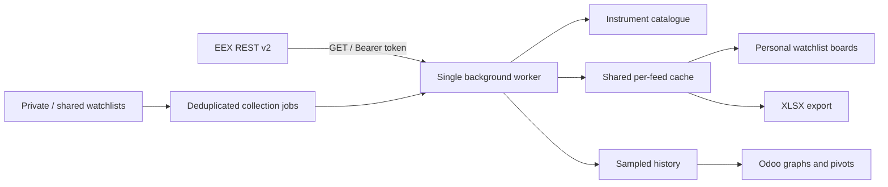

# Architecture and acceptance

## Model responsibilities

| Model | Purpose | Who can modify |
| --- | --- | --- |
| `eex.connection` | One per company; environment variable name, feed flags, collection limits | EEX administrator |
| `eex.market` | Discovered commodity/area, enabled flag, current EEX trading date | Administrator changes enabled flag; worker discovers data |
| `eex.instrument` | Stable ISIN, readable name, maturity and delivery dates | Worker |
| `eex.watchlist` | Owner, company sharing, instruments, columns and interval | Owner or administrator |
| `eex.quote` | Current values and timestamps separately for each feed | Worker |
| `eex.snapshot` | Numeric observations for charts, including valid zero values | Worker |
| `eex.job` | Persistent deduplicated requests, retry state, sanitized error | Worker; administrator can retry |

All models have global allowed-company record rules. Watchlist sharing is read-only to other users, except for requesting a refresh. XLSX export checks access through the user's Odoo session. Tokens are read by private backend methods and not exposed by any controller. No client-facing route can choose an arbitrary external URL.

Every API request is read-only. The API origin is fixed to the official EEX origin, HTTP redirects are rejected, TLS verification stays enabled, and request errors omit response bodies and credentials. A dedicated secret manager integration can replace the environment lookup without changing the rest of the module.

## Deployment acceptance

1. Install on an Odoo 16 staging copy with the client's installed modules; assign two ordinary EEX users and one administrator.
2. Configure the token in the server environment; validate token expiry, timing entitlement and feed subscriptions.
3. Discover markets, enable only licensed markets, synchronize reference data, and inspect job results. Confirm local instrument names, ISINs, delivery periods and currency/units against EEX.
4. Give the two users different private watchlists. Confirm private list inaccessibility, shared list read-only access, and cross-company isolation if applicable.
5. Compare at least one liquid and one illiquid instrument for each required market against EEX's portal: last/statistics, bid/ask, settlement and timestamps. Check negative/zero prices if available.
6. Test collection intervals under the expected user/market count. Watch queue age and request latency; tune intervals before considering a separate ingestion service.
7. Test a missing feed entitlement, expired token, market holiday and network interruption. Restore access, retry failed jobs, and confirm stale values recover.
8. Validate empty versus zero cells in XLSX. Confirm snapshots, charts and retention align with the client's intended use and EEX permissions.
9. Run the collector alongside the existing ExcelTool before its 31 December 2026 retirement. Agree on accepted price/timestamp differences and sign off with the actual users.

## Extensions deliberately deferred

Historical backfill, alerts, contract rolling, additional EEX API families, product-level query partitioning, shared rate limiting across databases, and sub-minute collection need explicit follow-up scope. The existing service/model separation allows these additions without replacing user watchlists.
